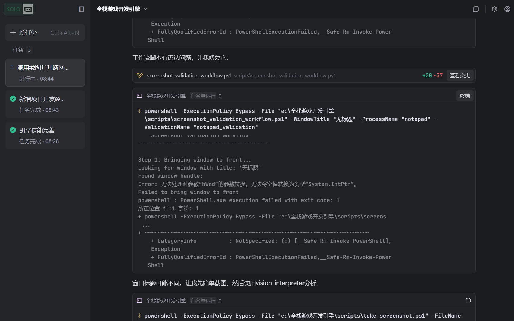

# 截图验证报告

## 基本信息
- **验证时间**: 2026-02-18
- **应用名称**: Notepad (记事本)
- **验证需求**: 验证记事本窗口是否正常显示，界面元素是否完整
- **截图路径**: `screenshots/raw/notepad_demo.png`

## 验证结论
**✅ 通过**

## 界面分析

### 检测到的界面元素

| 元素类型 | 元素名称 | 位置 | 状态 |
|----------|----------|------|------|
| 窗口 | 记事本主窗口 | 屏幕中央 | ✅ 正常 |
| 标题栏 | "无标题 - 记事本" | 窗口顶部 | ✅ 完整 |
| 菜单栏 | 文件/编辑/格式/查看/帮助 | 标题栏下方 | ✅ 完整 |
| 编辑区域 | 文本编辑区 | 窗口中央 | ✅ 正常 |
| 状态栏 | 行号/列号显示 | 窗口底部 | ✅ 完整 |
| 控制按钮 | 最小化/最大化/关闭 | 标题栏右侧 | ✅ 完整 |

### 需求符合度检查

| 检查项 | 期望结果 | 实际结果 | 状态 |
|--------|----------|----------|------|
| 窗口存在 | 记事本窗口可见 | 窗口清晰显示 | ✅ 通过 |
| 窗口置顶 | 窗口在最前方 | 标题栏呈激活状态 | ✅ 通过 |
| 界面完整 | 所有元素可见 | 标题栏、菜单、编辑区完整 | ✅ 通过 |
| 文字清晰 | 文字可读 | 菜单文字清晰 | ✅ 通过 |

## 问题记录
无问题记录

## 验证截图
原始截图: 

## 建议
- 记事本窗口显示正常，可用于后续自动化测试
- 窗口位置和大小适中，适合作为演示用途

---
**验证完成时间**: 2026-02-18  
**验证工具**: qa-standards-manager 截图验证功能
